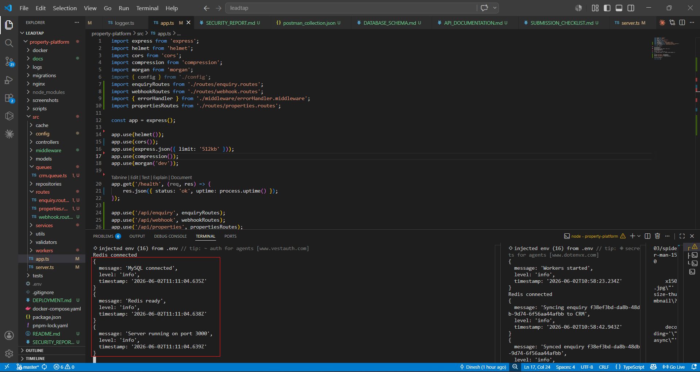
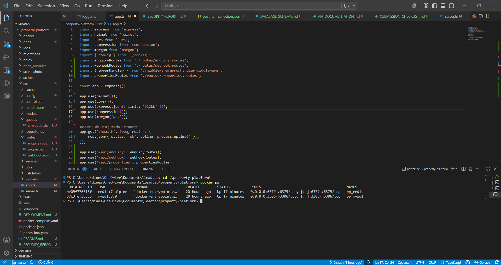
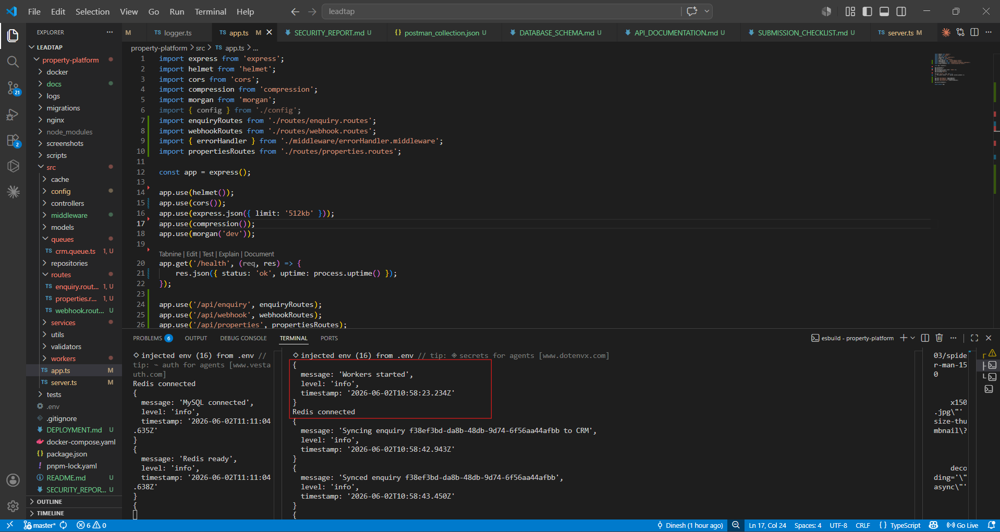
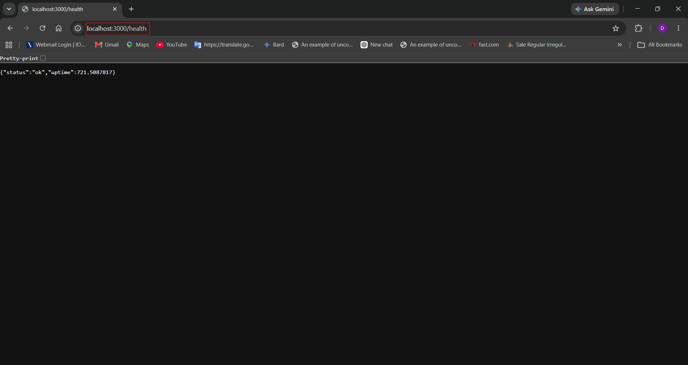
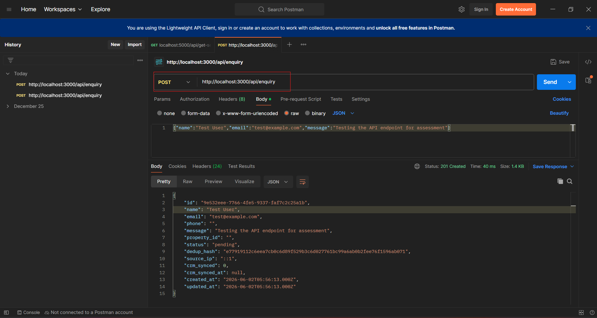

# Property Platform — Backend API

Production-ready backend system for a high-traffic property platform.

## Stack
- **Runtime**: Node.js 20 + TypeScript
- **Framework**: Express.js
- **Database**: MySQL 8.0
- **Cache**: Redis 7
- **Queue**: BullMQ
- **Validation**: Zod
- **Security**: Helmet, CORS, rate-limiting

## Quick Start

### Prerequisites
- Node.js 18+
- Docker & Docker Compose
- pnpm

### Setup

```bash
git clone <repo>
cd property-platform
pnpm install
docker-compose up -d
pnpm migrate
pnpm dev          # Terminal 1: API
pnpm workers      # Terminal 2: Background jobs
```

API runs on http://localhost:3000

### Health Check
```bash
curl http://localhost:3000/health
```

## API Endpoints

### Enquiries
- `POST /api/enquiry` — Create new enquiry
  - Body: `{name, email, phone?, message, property_id?}`
  - Returns: Enquiry object
  
- `GET /api/enquiry/:id` — Fetch by ID
  - Returns: Enquiry object
  
- `GET /api/enquiry` — Paginated list
  - Query: `?page=1&limit=10&status=pending|contacted|closed`
  - Returns: `{rows, meta: {total, page, limit, totalPages}}`

### Webhooks
- `POST /api/webhook/crm` — CRM sync webhook
  - Headers: `X-Hub-Signature` (HMAC-SHA256), `X-Idempotency-Key`
  - Returns: `{id, message}` with 202 Accepted

## Environment Variables
See `.env.example`

## Database
Migrations auto-run on startup. Schema includes:
- `enquiries` — Main enquiry table with indexes on email, status, created_at, property_id
- `webhook_events` — Webhook audit log

## Architecture
Client → Nginx (prod) / Express (dev)
↓
API Layer (routes + controllers)
↓
Services (business logic)
↓
Repository Layer (DB access)
↓
MySQL / Redis
↓
Queue Workers (BullMQ)

## Testing

```bash
pnpm test
```

## Deployment
See `DEPLOYMENT.md`

## Security
See `SECURITY_REPORT.md`

## Screenshots

### API Running


### Docker Containers


### Workers


### Health Check


### Create Enquiry (201)
